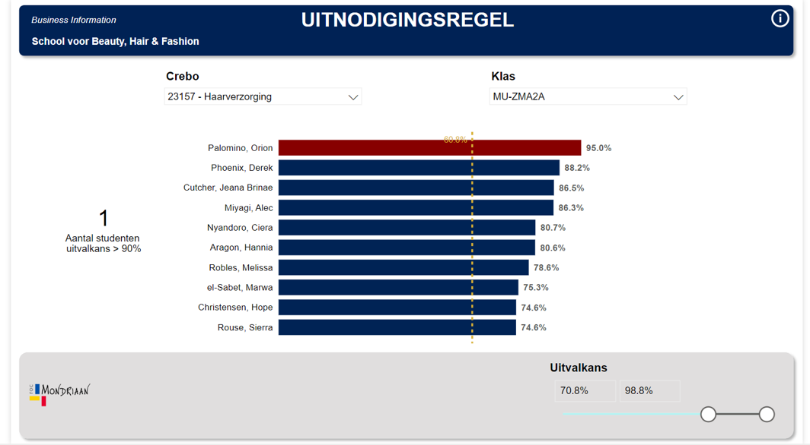

Studenten uitval voorspellen

# Waarom de Uitnodigingsregel
Onderwijsinstellingen worstelen al jaren om meer grip op uitval te krijgen. Steeds vaker wordt hierbij gebruikgemaakt van data over de studieontwikkeling van studenten.

In haar promotieonderzoek introduceerde [Irene Eegdeman](https://www.linkedin.com/in/irene-eegdeman-1b0a6b25) een methode om studenten met een verhoogd risico op uitval 
vroegtijdig te signaleren. Met behulp van studiedata en machine learning-modellen is de zogenaamde ‘uitnodigingsregel’ ontwikkeld.
Deze methode biedt SLB’ers en mentoren een signaleringssysteem om uitvalpreventie en -interventies effectiever in te zetten.

De methodiek genereert een geordende lijst van studenten op basis van hun uitvalkans.


## Achtergrond
Wil je meer weten over de Uitnodigingsregel? Bekijk dan [deze presentatie](https://datagedrevenonderzoekmbo.nl/wp-content/uploads/2023/09/Presentatie-MBO-Digitaal.pdf) van de MBO Digitaal-conferentie, waarin de belangrijkste resultaten, geleerde lessen en praktische tips worden gedeeld. Daarnaast geeft deze [praatplaat](https://datagedrevenonderzoekmbo.nl/wp-content/uploads/2023/09/Praatplaat-Methode-EegdemanV2-1-scaled.jpg) een visueel overzicht van de methode.

Meer informatie over het voorkomen van studentenuitval door middel van verklaringen en voorspellingen is te vinden in [dit artikel](https://www.onderwijskennis.nl/kennisbank/studentenuitval-voorkomen-door-verklaren-en-voorspellen). Voor de wetenschappelijke basis achter de methode kun je het [proefschrift van Irene Eegdeman](https://research.vu.nl/en/publications/enhancing-study-success-in-dutch-vocational-education) raadplegen.

Wil je de Uitnodigingsregel toepassen binnen jouw onderwijsinstelling? Houd dan rekening met een uitgebreide voorbereiding, waaronder een DPIA (Data Protection Impact Assessment). De Datacoalitie Datagedreven Onderzoek heeft deze methodiek zorgvuldig naar de praktijk vertaald. Lees [hier meer](https://datagedrevenonderzoekmbo.nl/category/themas/voorspelmodel) over dit proces en bekijk de [ontwikkelde producten](https://datagedrevenonderzoekmbo.nl/themas/voorspelmodel/praktijkpilot-de-uitnodigingsregel) die kunnen helpen bij een succesvolle implementatie van de Uitnodigingsregel.

<a target="_blank" href="https://cookiecutter-data-science.drivendata.org/">
    
</a>

## Project Organization

```
├── LICENSE            <- Open-source license
├── Makefile           <- Makefile with convenience commands
├── README.md          <- The top-level README
├── data
│   ├── external       <- Data from third party sources.
│   ├── interim        <- Intermediate data that has been transformed.
│   ├── processed      <- The final, canonical data sets for modeling.
│   └── raw            <- The original, immutable data dump.
│       └── user_data  <- Original data from user.
|
├── docs               <- A default mkdocs project
│
├── models             <- Trained and serialized models, model predictions, or model summaries
│
├── notebooks          <- Quarto files which 1) define required data, 2) validate data quality
│                         
│
├── pyproject.toml     <- Project configuration file 
│
├── references         <- Data dictionaries, manuals, and all other explanatory materials.
│
├── reports            <- Generated analysis as HTML, PDF, LaTeX, etc.
│   └── figures        <- Generated graphics and figures to be used in reporting
│
├── requirements.txt   <- The requirements file for reproducing the analysis environment
│
├── setup.cfg          <- Configuration file for flake8
│
└── Module   <- Source code for use in this project.
    │
    ├── __init__.py             <- Makes Module a Python module
    │
    ├── config.py               <- Store useful variables and configuration
    │
    ├── dataset.py              <- Scripts to download or generate data
    │
    ├── features.py             <- Code to create features for modeling
    │
    ├── modeling                
    │   ├── __init__.py 
    │   ├── predict.py          <- Code to run model inference with trained models          
    │   └── train.py            <- Code to train models
    │
    └── plots.py                <- Code to create visualizations
```

# Student dropout model


## Installation

## Use of program
--------

